# FreeMeditation.gr Advanced Course & Tutorial Module

## Aligned Product & UX Specification

This document consolidates the original specification and the approved alignment decisions. It is the canonical planning subject for the advanced-course module. Where a minor UX detail is not explicitly stated, use a common, conservative LMS pattern that preserves accessibility, privacy, factual progress, and server-authoritative behavior.

The target application is `freemeditation-gr`, located at `C:\Users\pvast\Desktop\tutorial`. Develop the module in isolation where useful, but deliver it as a merge-ready feature of the existing application rather than as a permanent separate platform.

## 1. Product Boundary

- The existing public website remains public. Home, First Meditation, the First Exercise steps, the four Beginner Lessons, ordinary Learn content, and Free Meetings do not require authentication.
- The advanced-course boundary is: public beginner content → **Continue your journey** → Login/Register → authenticated advanced learning.
- A successful `user` login routes to **My Course**.
- A successful `admin` or `master_admin` login routes directly to **Admin Dashboard**.
- `admin` and `master_admin` accounts can also enter **My Course** and use published courses as learners.
- The application remains one Next.js 16 App Router + React 19 + TypeScript 5.9 + PostgreSQL application.
- Project runtime and tooling are Docker-only.
- Authentication, authorization, learner progress, course administration, governance, reporting, and administrator management remain first-party application capabilities.

## 2. Roles and Navigation

The complete authenticated application-role set is exactly:

- `user`
- `admin`
- `master_admin`

An anonymous visitor is unauthenticated and has no role.

Admin Dashboard primary navigation is:

```text
Courses | Learners | Progress & Activity | Administrator Management (master_admin only) | My Course
```

- `user` can access published advanced courses matching the account's preferred course language and the account's own profile, progress, quiz history, notifications, export, and deletion operations.
- `admin` can manage course content, governance, learner lookup and factual progress, reporting, preview, and progress resets.
- `master_admin` has all `admin` capabilities and is the only web-application role permitted to grant or revoke `admin`.
- Only a controlled container-only bootstrap/recovery operation may create, promote, recover, revoke, or demote `master_admin` membership.
- The application must reject any operation that would leave zero active `master_admin` accounts.
- Authorization is enforced in server-only services for every protected query and mutation. UI hiding and redirects are not sufficient.
- Identity comes from the server session, never from submitted user IDs, email addresses, or role values.
- Public registration requires Display Name, Email, Password, an explicit Preferred Language (EL or EN), and explicit acceptance of the current Terms and Privacy policy. Missing or invalid acceptance prevents account creation.
- Email verification is mandatory before creation of a full authenticated course session or access to My Course, course content, learner progress, or administrator capabilities.

## 3. Course Structure

Supported hierarchy:

```text
Course → optional Module / Cycle / Lesson Group → Lesson → Lesson Items
```

- Groups are optional.
- A single course may mix grouped and ungrouped lessons.
- Lesson item types are Tutorial/Topic, Guided Meditation, and Quiz.
- Administrators explicitly order courses, groups, lessons, and lesson items.
- By default, completing a lesson unlocks the next lesson.
- Administrators may configure different factual prerequisite relationships.
- Optional lesson items may exist, but optional items can never control unlocking or required completion.

## 4. Course and Lesson Status

Course statuses:

```text
Locked → Available → In Progress → Completed
```

- Course progression is a strict, language-specific journey in administrator-defined course order.
- A learner may have at most one In Progress course at a time across the Published courses matching the account's current preferred language.
- If no matching course is In Progress, the earliest ordered matching Published course not already Completed is Available. Later incomplete courses are Locked and remain visible with a prerequisite explanation.
- A learner explicitly clicks **Start Course**. Publication or access alone does not start a course.
- Starting a course is allowed only for the one server-calculated Available course and opens its first available lesson. Locked courses cannot be opened or started through UI or direct requests.
- Completing a course automatically makes the next ordered incomplete matching Published course Available. Completing the final currently Published matching course produces the journey-complete state while preserving review access to all Completed courses.

Lesson statuses:

```text
Locked | Available | In Progress | Completed
```

- Opening an Available lesson does not start it.
- The learner explicitly clicks **Start Lesson**.
- After **Start Lesson**, remain on Lesson Overview and let the learner choose any available lesson item.
- Once a lesson is unlocked, all of its items are immediately available, including its quiz.
- A locked lesson card shows its title, short description, Locked status, and prerequisite explanation directly on the card.
- Locked lesson cards are not clickable.

## 5. Completion and Progress

- New lesson items are Required by default. Administrators may mark an item Optional.
- A lesson is Completed when every Required item is complete.
- Optional unfinished items remain accessible and do not block lesson completion.
- Lesson progress percentage counts Required items only.
- Course progress percentage is lesson-based: completed required lessons divided by total required lessons.
- Completed courses remain fully accessible for review.
- **Resume Course** opens the first incomplete Required item in the first incomplete lesson.
- Completed items remain freely accessible for review; resume behavior does not restrict ordinary navigation.
- Course and lesson completion timestamps are stored and do not disappear when content is revisited.
- A persisted course or lesson completion is evaluated against the published requirement/revision baseline completed by that learner. Later course insertion/reordering or later Required lesson/item additions do not retroactively revoke that completion or its timestamp.
- Newly inserted or newly published courses remain incomplete for existing learners and enter the strict journey at their administrator-defined position. Previously Completed later courses remain Completed; when no course is In Progress, the earliest ordered incomplete course becomes Available.
- Historical completion changes only through an explicit authorized reset or other documented audited operation. Ordinary content editing, publishing, ordering, or revisiting never rewrites it.
- All progress calculations, prerequisite decisions, completion transitions, historical baselines, and unlocking decisions are server-enforced and persisted in PostgreSQL.

## 6. Tutorial and Meditation Completion

### Tutorial/Topic

- Reaching the end reveals a **Complete Tutorial** button.
- Completion is recorded only when the learner clicks that button.
- Reopening a partially read tutorial starts at the top; scroll position is not persisted.

### Guided Meditation

- For audio/video meditation, completion is recorded automatically when the media finishes.
- For text-only meditation, completion is recorded automatically when the learner reaches the end.
- If a learner leaves an incomplete meditation and returns, the media or content starts from the beginning rather than resuming an exact position.
- Use privacy-enhanced official video embeds where applicable, with accessible transcript/caption metadata and a direct fallback.

## 7. Quiz Rules

Supported question types:

- Single-choice.
- Multiple-choice with multiple correct answers.
- True/False.
- Free-text questions are not supported.

Quiz behavior:

- Every attempt contains all configured questions.
- Question order and answer-option order are randomized on every attempt.
- Each quiz has an administrator-configured minimum passing percentage.
- Passing the quiz does not complete the lesson if other Required items remain incomplete.
- Administrators configure the maximum attempts per quiz; Unlimited is valid.
- Administrators configure per quiz whether correct answers are revealed after a failed attempt.
- When attempts are exhausted, administrators configure either administrator reset or automatic reset after a configured waiting period.
- Learners can see full attempt history: attempt number, date/time, score, and pass/fail.
- Administrators can see full attempt history, including submitted answers, subject to the retention and privacy policy.
- Once a quiz is passed, it cannot be retaken unless an administrator resets it.
- A quiz reset preserves historical attempts and starts a new attempt cycle.
- The latest attempt in the active cycle determines status until Pass. Historical cycles remain immutable audit records.
- Quiz questions and feedback confirm factual participation or understanding only. They must not evaluate spiritual development.

## 8. Administrative Progress Reset

- Administrators may reset a quiz, an individual lesson, or an entire course for a learner.
- Historical progress is preserved for audit; reset is not destructive deletion.
- Before confirmation, the UI shows an impact preview listing dependent progress that will also be reset.
- Resetting an earlier lesson resets later dependent lesson completion and recalculates prerequisites.
- Resetting a course or lesson must preserve unrelated progress.
- The learner receives a notification when an administrator resets progress.
- Reset audit records include actor, learner, scope, affected dependencies, before/after state references, reason where required, and server timestamp.

## 9. Notifications

- Learners have a simple chronological notification history/bell area.
- There is no unread counter and no read/unread management.
- Notifications cover important events such as new course publication, new lesson or content publication, progress resets, and important course updates.
- Publication notifications are targeted by course language: EL content notifies EL-preference learners; EN content notifies EN-preference learners.
- If a learner changes preferred language, existing notification history remains unchanged. Future publication notifications follow the new preference.
- Notifications use server timestamps; learner UI presents dates in a human-readable local format.
- Provide an explicit empty state when there are no notifications.

## 10. Course Access and My Course

- Every registered learner automatically has access to every Published course matching the account's preferred course language.
- No manual enrollment is required.
- A learner may have only one matching course In Progress at a time. Progress remains independently stored for every course.
- My Course shows every Published course matching the account's preferred language, including future Locked courses, in administrator-defined journey order.
- Completed courses remain reviewable in place. The one In Progress or Available course and all later Locked courses make the next step in the journey clear without hiding future content.
- Administrator-defined course order is the canonical journey order; filtering or searching does not reorder results.
- Course cards show cover image, title, short summary, factual progress/status, completed and total required lessons, and a clear Start/Continue/Open action.
- Card actions are **Start Course** for Available, **Continue Learning** or **Resume Course** for In Progress, and **Review Course** for Completed. Continue/Resume uses the server-calculated resume target from Section 5 rather than defaulting to the first lesson.
- My Course provides title search and status filters for All, In Progress, Available, Completed, and Locked without changing administrator-defined journey order.
- A course remains Available until the learner explicitly clicks **Start Course**. Starting it makes that course In Progress; no other matching course may be started concurrently.
- Locked course cards show title, cover/summary, Locked status, and the course prerequisite directly on the card; they are not clickable.
- When every currently Published matching course is Completed, show the explicit message **You have completed all currently available courses.** All Completed courses remain available for review.
- If another matching course is later Published or inserted into the sequence, it participates prospectively under the historical-completion rules in Section 5 and becomes the next Available course when it is the earliest ordered incomplete course.
- Provide an explicit empty state when no matching Published courses are available.

### 10.1 Learner Course Overview and Player UI

Use a familiar modern course-player composition while preserving this specification's domain model and the application's calm visual language. Do not copy another platform's branding or introduce a separate tutorial system.

#### Course Overview

- The Course Overview combines course title, cover/summary, factual lesson-based progress, the correct Start/Resume/Review action, descriptive information, and the complete curriculum.
- The curriculum shows optional groups and ungrouped lessons in administrator-defined order. Each lesson shows its status, Required-item progress, and prerequisite explanation when Locked.
- Learners must be able to distinguish completed, current/in-progress, available, and locked lessons without relying on color alone.
- Groups are collapsible for presentation, but collapsing a group never changes progress or access.

#### Lesson and Item Player

- Desktop uses a primary content region plus a persistent **Course Content** sidebar. At mobile widths, the same sidebar becomes an accessible drawer or disclosure; it is not removed.
- The sidebar represents the complete course tree, not only the current lesson: groups, ungrouped lessons, and each lesson's ordered Tutorial/Topic, Guided Meditation, and Quiz items.
- The sidebar displays factual course progress and completed/total required lessons. Remaining work is derived from the ordered course structure and persisted progress; do not maintain a separate hard-coded remaining-items list.
- Clearly represent Completed, Current/In Progress, Available/Not Started, Locked, and quiz retry/exhausted states with text or accessible labels as well as icons. The current lesson item is visually highlighted and exposed with `aria-current` where appropriate.
- Automatically expand the group and lesson containing the current item and bring the current item into view without disruptive motion. Respect reduced-motion preferences.
- Locked lessons remain visible with their prerequisite explanation and cannot be opened. Direct requests remain protected by server authorization and prerequisite checks.
- Once a lesson is unlocked and explicitly started, every item in that lesson is navigable in any order, consistent with Section 4.
- The content region renders the existing supported item types: formatted Tutorial/Topic content, text/audio/video Guided Meditation content, and Quiz. Do not add Assignment, generic Document, or other production item types unless this canonical subject is revised.
- A lesson item may expose administrator-configured supporting resources such as an accessible transcript, canonical source, downloadable document, or external reference link. Resources must use safe validated URLs, descriptive labels, and appropriate external-link behavior.
- Provide **Back to Course**, **Back to Lesson**, and **Previous/Next item** navigation. Previous/Next traverses the administrator-defined item order across lesson and group boundaries but must not bypass Locked lessons or unmet prerequisites.
- At the end of an item's sequence, present the next valid project action based on persisted state, such as returning to the lesson, opening the next unlocked lesson, or reviewing the Completed course. Do not use a client-only **Complete Course** action to override Required completion rules.

#### Shared Component and Data Rules

- Course Overview curriculum and player sidebar consume one shared, server-derived curriculum/progress view model and shared tree components; do not duplicate ordering, state, prerequisite, or remaining-work logic.
- Reuse components along these responsibility boundaries where they fit confirmed repository conventions: course card/list controls, progress summary, curriculum tree, curriculum group, lesson row, item row, player shell, typed item renderer, resources, and previous/next navigation.
- The player shell owns layout and navigation only. Item-specific completion behavior remains owned by Tutorial/Topic, Guided Meditation, and Quiz capabilities.
- Browser UI may preserve presentation preferences such as expanded groups, but PostgreSQL-backed server state remains authoritative for access, current/resume target, progress, and completion.

### 10.2 YouTube Video Links

- Administrators may attach an approved official YouTube video URL to a video Guided Meditation item where the content and governance rules permit it.
- Accept only validated YouTube video URLs/identifiers from an explicit allowlist of supported URL forms. Normalize the stored reference instead of rendering arbitrary administrator HTML or iframe markup.
- Render YouTube through the privacy-enhanced `youtube-nocookie.com` embed domain with a descriptive title, responsive aspect ratio, keyboard-accessible controls, transcript/caption metadata, and a direct YouTube fallback link.
- The direct fallback clearly indicates that it opens YouTube and may be subject to YouTube's privacy terms. External navigation must not silently mark the item complete.
- Automatic completion may occur only from a trustworthy embedded-player ended event processed through the server-authoritative completion capability. If completion cannot be verified, provide a safe fallback consistent with the configured Guided Meditation completion rule rather than guessing from elapsed browser time.
- Do not persist or restore an exact YouTube or media playback position. Incomplete media restarts from the beginning as required by Section 6.

## 11. English / Greek Course Model

**Important alignment decision:** EL and EN are not localized variants of one course. They are independent course records.

- Every course has one required language property: `EL` or `EN`.
- A course cannot contain both languages.
- Everything inside a course follows the course language, including groups, lessons, tutorials, meditation content, quizzes, answers, feedback, titles, descriptions, and all learner-facing course content.
- EL and EN courses can have completely independent structures.
- Learner progress is independent for every course.
- Once learner progress exists for a course, its language cannot be changed.
- A separate course must be created for the other language.
- This decision replaces the original requirement to store governed EN and EL variants inside one course record.

## 12. Site Language vs Preferred Course Language

- The public website defaults to Greek.
- The public site provides an EL/EN switcher and remembers the visitor's last selected site language in that browser.
- Registration explicitly asks the learner to choose a preferred language instead of silently deriving it from the current page.
- For authenticated users, preferred language is stored in the account and follows the user across devices.
- My Course shows only courses whose `course.language` matches `users.preferred_language`.
- A learner can change preferred language from My Profile at any time.
- Changing preferred language immediately changes the learner interface to that language and routes to the corresponding My Course.
- Progress in courses of the previous language remains stored and unchanged.
- Public-site language may temporarily differ from account preferred language. Visiting a public `/el` or `/en` page does not modify the account preference.
- While a learner is inside a course, the language switcher is hidden or disabled. The learner must leave the course before switching language.

### 12.1 Static Interface Localization

- All static public-site and learner-interface copy is loaded from exactly `src/content/en.json` and `src/content/el.json`.
- The two JSON files use matching keys and structure. Key namespaces should follow stable interface domains such as `common`, `navigation`, `auth`, `myCourse`, `course`, `lesson`, `quiz`, `profile`, `notifications`, and `errors`.
- Public and learner React pages/components must not hard-code user-facing copy. Dynamic PostgreSQL course content, learner-entered/account data, and server-provided factual values are interpolated separately and do not belong in these JSON files.
- Server capabilities return stable language-neutral identifiers or English codes such as `COURSE_LOCKED`; the public/learner frontend maps those codes to EL/EN messages from the two JSON files. Do not return localized authorization or progression decisions from the browser.
- Administration UI, backend identifiers/codes, logs, migrations, audit infrastructure, and Docker/operations documentation are English-only. Learner-facing course content remains stored in PostgreSQL in its course's required EL or EN language.

## 13. Admin Language Behavior

- Admin Dashboard and all administration forms are English-only.
- Administrators see EL and EN courses together.
- Courses provides a Language filter: All | Greek (EL) | English (EN).
- Learners provides a Preferred Language filter: All | Greek (EL) | English (EN).
- Progress & Activity provides a Language filter: All | Greek (EL) | English (EN).
- When editing an EL course, administration labels remain English while entered course content is Greek. The equivalent applies to EN content.

## 14. Common UX Decisions

- My Course retains administrator-defined journey order across Completed, In Progress, Available, and Locked course states.
- Course and lesson completion timestamps are stored; revisiting content does not erase completion.
- **Start Course** opens the first available lesson of the one server-calculated Available course; course completion makes the next ordered incomplete course Available.
- **Start Lesson** leaves the learner on Lesson Overview.
- Navigation provides clear **Back to Course** and **Back to Lesson** actions and previous/next navigation where appropriate.
- Destructive administrator actions require confirmation.
- Progress resets additionally require an impact preview.
- Save and Publish remain separate. Saving edits never publishes implicitly.
- Draft and unpublished content is never learner-visible.
- Preview as Learner does not impersonate a learner or alter real learner progress.
- Course removal after learner activity uses archival or unpublication rather than destructive deletion, preserving progress and history.
- Notifications and audit records use server timestamps; UI dates use a human-readable local format.
- Empty states are explicit for no available courses, no notifications, no quiz attempts, and no matching learner or report filters.
- All progress and authorization decisions are server-enforced; browser state is never authoritative.
- The visual language remains calm, warm, spacious, editorial, and trustworthy. Avoid competitive LMS patterns, streak pressure, points, leaderboards, and excessive badges.
- Build mobile-first and validate critical flows around 390px and desktop widths.
- Use semantic HTML, visible keyboard focus, accessible forms and errors, reduced-motion support, non-color-only states, and sensible focus after navigation and actions.
- Reuse the target repository's established styling system. If no styling system is present or mandated, use SCSS organized as global design tokens, shared styles, component styles, and minimal page-specific styles; do not introduce a second competing styling framework.

## 15. Admin Content Workflow

- An administrator creates a course and must select EL or EN.
- A course can be saved as Draft before all publication requirements are satisfied.
- A course supports cover image, accessible alt text, description/summary, administrator-defined ordering, optional groups, lessons, items, and factual access requirements.
- Course cover images must support provenance/attribution where required and responsive focal-point/crop behavior.
- A Published course requires an approved usable cover image and accessible text. Legacy or migrated courses without one use a calm branded fallback rather than broken-image UI.
- Content administration uses purpose-built first-party schemas, server-side validation, transactions, authorization policies, audit metadata, and reviewed migrations.
- Tutorial and meditation content uses a small, purpose-built block set rather than a generic page builder.
- Governance remains:

```text
Draft → Language Review → Sahaja Review → Publishable → Published
```

- EL content requires recorded Greek-language review.
- Spiritual teaching requires recorded Sahaja review.
- Governance actions are capabilities of `admin` and `master_admin`, not additional authentication roles.
- Human review cannot be replaced by AI approval.
- Save actions do not bypass governance.
- Published content can be unpublished or archived without deleting learner history.
- Spiritual teaching, tutorials, guided meditations, quiz explanations, and spiritual learning points support canonical source attribution.
- Do not invent spiritual teachings, fake Shri Mataji imagery, or inaccurate spiritual diagrams.

## 16. Learner Flow

1. Visit the public website and use beginner material without login.
2. Choose **Continue your journey**.
3. Register with Display Name, Email, Password, explicit EL/EN preference, and Terms/Privacy acceptance, or log in to an existing account.
4. Verify the email address before authenticated course access.
5. A verified `user` routes to My Course; a verified `admin` or `master_admin` routes to Admin Dashboard.
6. On My Course, see every Published course matching the account's preferred language in administrator-defined journey order: Completed history, at most one In Progress course, otherwise one Available course, and later Locked courses.
7. Choose the one Available course and click **Start Course**.
8. See Course Overview with grouped and/or ungrouped lessons.
9. Open an Available lesson and click **Start Lesson**.
10. Choose any lesson item in any order.
11. Complete Required tutorials and meditations and pass any Required quiz.
12. The lesson becomes Completed; the next lesson unlocks according to configured prerequisites.
13. Continue until all required lessons are complete.
14. The course becomes Completed, remains available for review, and the next ordered incomplete course becomes Available automatically.
15. On later login, **Resume Course** opens the first incomplete Required item of the first incomplete lesson in the one In Progress course.
16. When no Published matching course remains incomplete, show the journey-complete message from Section 10.

Learner utility views include My Profile, My Progress, Help / Information, Notifications, Quiz Attempt History, and Logout.

## 17. Administrator Flow

1. Login → Admin Dashboard.
2. Courses → list/filter all EL and EN courses → Course Details → create/edit/order/access/governance/preview.
3. Course Details → Lessons → Lesson Details → topics, guided meditation, quiz, and requirements.
4. Learners → search/filter permitted factual learner data → Learner Details → Learner Progress.
5. Progress & Activity → aggregate factual course activity with course/language filters.
6. Progress reset → select scope → see impact preview → confirm → preserve history → recalculate dependencies → notify learner.
7. `master_admin` only: Administrator Management for `admin` membership.
8. `admin` and `master_admin` may use My Course as learners without weakening administrative authorization boundaries.

## 18. Privacy and Reporting

- Collect only necessary account and course/progress data: ID, display name, email, preferred language, progress records, quiz records, notifications, audit data, and required timestamps.
- Do not collect age, gender, health information, religious or spiritual status, meditation quality, chakra/Kundalini state, or spiritual scores.
- Permitted learner filters include course, registration date, factual completion percentage/status, lesson/item/quiz completion, and preferred language.
- Other filters require explicit justification and must use data allowed by this specification.
- Reporting is factual and non-competitive. Do not provide leaderboards, engagement manipulation, or spiritual/quality rankings.
- Administrator access to learner records is server-authorized, least-privilege, and auditable.
- Architect for account deletion, progress deletion, and personal-data export without erasing required security/audit evidence improperly.

## 19. Technical Compatibility

- Next.js 16 App Router, React 19, and TypeScript 5.9.
- PostgreSQL with reviewed SQL migrations and a minimal, explicitly justified database access layer confirmed against the target repository.
- First-party authentication with opaque, revocable, PostgreSQL-backed sessions.
- Store only the hash of a session token in PostgreSQL. Send the raw token only in a Secure, HttpOnly, SameSite=Lax cookie in production.
- Re-evaluate role and account status from PostgreSQL on protected requests.
- Public registration always creates `user`; no browser-submitted value may assign `admin` or `master_admin`.
- Email verification is mandatory and gates creation of a full authenticated course session for every role.
- Use one shared server-only safe-`returnTo` validator. Accept only approved localized relative learner paths; reject external, protocol-relative, backslash, encoded-bypass, auth-loop, and admin destinations.
- No Keycloak, Firebase, Supabase, Auth0, MongoDB, hosted/external CMS, separate Java/Python backend, or generic LMS framework.
- Do not introduce Payload CMS, Strapi, Sanity, Contentful, Directus, WordPress, or another generic CMS runtime.
- Docker Compose is the only supported project execution interface for development, testing, migration, build, administration, and production-image validation.
- Required containerized services include the Next.js application and local PostgreSQL. Add narrowly justified supporting containers only when confirmed requirements need them.
- The host requires Docker Engine/Desktop and Docker Compose only. Do not require a host installation of Node.js, npm, framework CLIs, migration tools, test runners, or PostgreSQL clients, and do not document native-host alternatives.
- Every application command, including dependency installation, development server, linting, formatting checks, type checking, unit/integration/end-to-end tests, migrations, seed/fixture loading, administrative recovery, production build, backup/restore, and teardown, runs through Docker Compose services or explicit Compose run commands.
- Source code may be bind-mounted for development, but application dependencies and generated runtime artifacts must remain container-managed and must not depend on host `node_modules` or a host project runtime.
- PostgreSQL is not publicly exposed.
- Use a pinned Node image, reproducible installs, health checks and dependency readiness, multi-stage production builds, and a non-root production user.
- Canonical learner routes remain under `/[locale]/...`, where locale represents interface/public-site language.
- Course access must additionally validate the course language against the learner context where required.
- Server-side authorization is authoritative for protected data, prerequisites, progress, preview, reporting, resets, and role management.
- Preserve the existing public site and reuse confirmed target-repository localization, routing, style, and database conventions rather than creating parallel systems.

## 20. Required Data Model Adjustments

At minimum, planning and implementation must support:

- `courses.language`: required enum/check value `EL | EN`.
- Course text/content belongs to the one language of its course; paired EN/EL translation records are not mandatory.
- `users.preferred_language`: required `EL | EN` for registered accounts.
- Registration records the required display name and auditable Terms/Privacy acceptance associated with the accepted policy version or equivalent immutable policy reference and server timestamp.
- `lesson_items.required`: boolean, default `true`.
- Explicit ordering and factual prerequisite relationships for courses, groups, lessons, and items.
- Course-start, lesson-start, item-completion, lesson-completion, course-completion, and resume state with timestamps.
- Persist enough published-revision/requirement-baseline identity with completion records to preserve historical completion after later course insertion, reordering, or Required content additions.
- Enforce at the database/service boundary that a learner cannot have more than one In Progress course for the applicable language journey, including concurrent Start Course requests.
- `quizzes.pass_percentage`.
- `quizzes.max_attempts`, nullable or otherwise explicit for Unlimited.
- `quizzes.reveal_correct_answers_on_failure`.
- `quizzes.exhaustion_policy`.
- `quizzes.reset_wait_duration`, where applicable.
- Immutable quiz attempt/cycle history and submitted-answer records, subject to retention/privacy rules.
- Notifications with recipient, event type, course language/context, message/content reference, and created timestamp. Read/unread state is unnecessary.
- Progress-reset audit records with actor, learner, scope, affected dependencies, before/after state references, and timestamp.
- Governance records with actor, timestamp, content revision, locale/course language, decision, and optional notes.
- First-party users, sessions, email-verification tokens, password-reset tokens, administrator invitation tokens, and authentication audit events.
- At least one active `master_admin` must always remain.

Physical table and column names may adapt to confirmed target-repository conventions without changing these domain rules.

## 21. Acceptance Summary

- Public beginner content remains accessible without authentication.
- Advanced learning begins at Login/Register after **Continue your journey**; registration requires the specified fields and mandatory email verification before authenticated access.
- `user` → My Course; `admin`/`master_admin` → Admin Dashboard.
- Course language is one required EL/EN property; EL and EN courses are separate and progress is independent.
- Static public/learner copy comes only from matching-key `src/content/en.json` and `src/content/el.json`; course content remains in PostgreSQL.
- My Course displays all Published courses matching preferred language in administrator-defined journey order, with at most one In Progress course, otherwise one Available course, and later incomplete courses Locked.
- Historical course/lesson completion survives later ordering and Required-content changes unless an explicit audited reset applies.
- Course → optional groups → lessons → Required/Optional items.
- Lessons unlock sequentially by default; all items within an unlocked lesson are immediately accessible.
- Tutorial completion requires reaching the end plus an explicit completion action.
- Meditation completion is automatic at the configured factual end condition.
- Quiz completion requires the configured passing percentage and attempt rules.
- Required items alone determine lesson completion and unlocking.
- Progress, quiz attempts, reset cycles, notifications, reporting, governance, privacy, and authorization are persisted and server-enforced.
- Draft/unpublished content is unavailable to learners.
- Administrators can manage course content, governance, learner lookup/progress, factual reporting, preview, and audited progress resets.
- Only `master_admin` can manage `admin` membership; the web application cannot manage `master_admin` membership.
- The module remains merge-ready for the existing `freemeditation-gr` Next.js/PostgreSQL application.
- The application, database, migrations, builds, tests, and development workflow run successfully through Docker Compose without requiring a native project runtime on the host.

## 22. Integration and Delivery Requirements

The isolated deliverable may use this structure where it remains compatible with the target repository:

```text
advanced-learning/
  README.md
  docs/
  src/{components,features,lib,server,types,tests}/
  integration/
    INTEGRATION.md
    ROUTES.md
    DATABASE.md
    AUTH.md
    CONTENT-ADMIN.md
    DOCKER.md
    ENVIRONMENT.md
    MERGE-CHECKLIST.md
  demo-app/   # optional development shell only
  module/     # reusable code when demo-app is used
```

- Keep reusable module code independent from any optional demo shell.
- Inspect the target repository before finalizing routes, physical schemas, migration conventions, dependencies, cookie/domain behavior, mail transport, tests, localization, or CSS integration.
- Create a traceability table mapping every diagram node to its route or UI state, component/capability, permission, data dependency, and verification.
- Use local Dockerized PostgreSQL only for development and tests. Never connect development containers to production, staging, or historical databases.
- Provide reviewed migrations, rollback guidance, Docker configuration, environment documentation, test fixtures, and merge-risk documentation.
- `integration/DOCKER.md` (or the confirmed repository-equivalent operations document) must be sufficient for a contributor starting with Docker only. Document prerequisites, environment-file creation without committing secrets, image build, first startup, database readiness and migration, development app URL, logs, restart, rebuild after dependency changes, lint/type-check/test/build commands, seed or fixture use, administrator bootstrap/recovery, backup/restore, volume-safe stop, destructive clean reset with a clear data-loss warning, and teardown.
- Docker documentation must provide copy-pasteable Docker Compose commands from the repository root, explain expected service names and successful startup/health evidence, distinguish routine stop from volume deletion, and include common recovery steps for port conflicts, stale images/volumes, failed health checks, and migration failures.
- The root README or confirmed primary contributor document links to the Docker operations document and presents Docker Compose—not native Node/npm/PostgreSQL commands—as the canonical way to run the application.
- Use placeholders rather than invented spiritual curriculum or media.
- Preserve existing code and migration history; do not schema-push against unknown databases.

## 23. Required Validation

Validation must cover at least:

- Registration fields, Terms/Privacy acceptance and policy-reference audit, mandatory verification for every role, login, logout, password reset, protected-route behavior, and safe `returnTo`.
- Public and learner static copy is sourced only from matching-key `src/content/en.json` and `src/content/el.json`; missing keys, hard-coded learner/public copy, code-to-message mapping, and separation from PostgreSQL course content are validated.
- Public registration cannot obtain `admin` or `master_admin` through direct or nested request input.
- Role-management rules, invitation security, concurrent invitation acceptance, audit events, and last-active-`master_admin` protection.
- My Course filtering and administrator journey ordering by preferred language and Locked/Available/In Progress/Completed status.
- Strict course sequencing allows at most one In Progress course, exposes exactly one Available course when none is In Progress, keeps later courses visibly Locked, denies direct locked-course access, and remains correct under concurrent Start Course requests.
- Completing a course automatically exposes the next ordered incomplete course; completing the final currently Published course shows the explicit journey-complete state, and a later publication becomes Available according to order.
- Course insertion/reordering and later Required lesson/item additions preserve existing completion timestamps/status while making newly incomplete inserted content the next required course without rewriting later Completed history.
- My Course title search, status filters, course-card actions, factual progress summaries, and server-calculated resume targets.
- Explicit Start Course and Start Lesson behavior.
- Mixed grouped/ungrouped lessons and locked non-clickable lesson cards.
- Course Overview and player use one shared curriculum/progress source; the complete tree, current-item highlight, collapsible state, locked explanations, and remaining work remain correct at desktop and approximately 390px widths.
- Previous/Next item navigation crosses lesson/group boundaries in administrator order without bypassing prerequisites, while Back to Course and Back to Lesson remain available.
- Required/Optional item behavior, percentages, completion, unlocking, revisit, and exact resume target.
- Tutorial, media meditation, and text meditation completion behavior.
- Approved YouTube URL validation/normalization, privacy-enhanced responsive embeds, accessible title/transcript/caption metadata, direct fallback behavior, trustworthy ended-event completion, and no exact playback-position persistence.
- Quiz randomization, pass percentage, attempt limits, exhaustion behavior, answer reveal policy, history, pass lockout, and reset cycles.
- Quiz, lesson, and course reset impact previews, dependency recalculation, preserved history, authorization, audit, and learner notifications.
- Publication notifications by preferred language and language-change behavior.
- Draft/governance/publication boundaries and source attribution.
- EL/EN course independence, immutable course language after progress, and no unsafe cross-language access or fallback.
- Administrator course, lesson, item, quiz, ordering, access, governance, learner, reporting, preview, reset, and administrator-management workflows.
- Privacy-safe filters and factual non-competitive reporting.
- Keyboard, focus, semantic, form/error, quiz announcement, reduced-motion, responsive image/video, and 390px/desktop behavior.
- Docker-only setup, migration, lint, type checking, tests, production build, backup/restore, and teardown.
- A clean Docker-only contributor walkthrough validates documented environment setup, image build, first startup, health/readiness, migration, application access, logs, routine stop/restart, rebuild, validation commands, backup/restore, and teardown without using a native project runtime.

## 24. Definition of Done

- Every applicable learner and administrator node and transition in the flowchart below maps to an implemented view, integrated panel/state, server-authorized capability, or documented safe equivalent.
- A public visitor can complete beginner content, continue to authentication, and reach the correct role landing page.
- A learner can follow the strict ordered language-matching course journey, with no more than one In Progress course, automatic next-course availability, a final journey-complete state, and persisted reviewable completion history.
- Locked courses, lessons, and items cannot be bypassed through direct server calls.
- Administrators can manage purpose-built governed course content and factual learner progress without a generic CMS or second backend.
- Progress reset, notification, quiz-history, reporting, governance, and role-management rules are implemented and tested.
- The module merges into the existing Next.js/PostgreSQL application without recreating the public site or global shell.
- Integration documentation, diagram traceability, Docker configuration, migrations, tests, rollback guidance, and final handoff are complete.

## 25. Corrected Product and Navigation Flowchart

```mermaid
flowchart TD

%% PUBLIC ENTRY AND AUTHENTICATION BOUNDARY
START([Open FreeMeditation.gr]) --> PUBLIC[Public Website<br/>Beginner and ordinary public content remains public]
PUBLIC --> BEGINNER[Use Beginner Content]
BEGINNER --> CONTINUE[Continue your journey]
CONTINUE --> AUTH{Authenticated?}
AUTH -->|No| LOGIN[Login / Register]
LOGIN --> VERIFY[Require email verification<br/>Validate account, session, and safe returnTo]
VERIFY --> ROLE{Authenticated role}
AUTH -->|Yes| ROLE
ROLE -->|user| U_HOME
ROLE -->|admin or master_admin| A_HOME

subgraph USER["LEARNER / MY COURSE"]
  U_HOME[My Course<br/>Matching Published courses in journey order<br/>Completed, In Progress, Available, Locked]
  U_EMPTY[No Available Courses<br/>Explicit empty state]
  U_NOTIFICATIONS[Notifications<br/>Chronological history; no unread state]
  U_PROFILE[My Profile<br/>Account details and preferred language]
  U_PROGRESS[My Progress<br/>Factual course, lesson, item, and quiz history]
  U_HELP[Help / Information]

  U_HOME -->|No matching published courses| U_EMPTY
  U_EMPTY --> U_HOME
  U_HOME -->|Locked: prerequisite course incomplete| U_LOCKED_COURSE[Locked Course Card<br/>Visible journey position and prerequisite<br/>Not clickable]
  U_LOCKED_COURSE --> U_HOME
  U_HOME --> U_NOTIFICATIONS
  U_NOTIFICATIONS --> U_HOME
  U_HOME --> U_PROFILE
  U_PROFILE -->|Change preferred language| U_LANGUAGE[Update account preference<br/>Route to corresponding My Course]
  U_LANGUAGE --> U_HOME
  U_PROFILE --> U_HOME
  U_HOME --> U_PROGRESS
  U_PROGRESS --> U_HOME
  U_HOME --> U_HELP
  U_HELP --> U_HOME

  U_HOME -->|Available: Start Course| U_START_COURSE[Persist course start<br/>Status becomes In Progress]
  U_HOME -->|In Progress: Continue| U_COURSE
  U_HOME -->|Resume Course| U_RESUME[Find first incomplete Required item<br/>in first incomplete lesson]
  U_HOME -->|Completed: Open| U_COURSE
  U_START_COURSE --> U_SINGLE_ACTIVE[Enforce no other In Progress course]
  U_SINGLE_ACTIVE --> U_FIRST_LESSON[Open first Available Lesson Overview]
  U_FIRST_LESSON --> U_LESSON
  U_RESUME --> U_ITEM_ROUTE[Open calculated lesson item]

  U_COURSE[Course Overview<br/>Optional groups plus ungrouped lessons<br/>Available, In Progress, Completed, Locked]
  U_COURSE -->|Locked card: not clickable| U_LOCKED[Locked Lesson Card<br/>Title, summary, status, prerequisite explanation]
  U_LOCKED --> U_COURSE
  U_COURSE -->|Open Available/In Progress/Completed lesson| U_LESSON[Lesson Overview<br/>Introduction, learning points, Required/Optional items]
  U_LESSON -->|Available: Start Lesson| U_START_LESSON[Persist lesson start<br/>Remain on Lesson Overview]
  U_START_LESSON --> U_LESSON_ACTIVE[Lesson Overview: In Progress<br/>All lesson items immediately available]
  U_LESSON -->|In Progress or Completed| U_LESSON_ACTIVE
  U_LESSON_ACTIVE --> U_CHOOSE{Choose any lesson item}

  U_CHOOSE --> U_TUTORIAL[Tutorial / Topic]
  U_TUTORIAL --> U_TUTORIAL_END[Reach end of content]
  U_TUTORIAL_END -->|Click Complete Tutorial| U_ITEM_COMPLETE[Persist item completion]
  U_CHOOSE --> U_MEDITATION[Guided Meditation]
  U_MEDITATION --> U_MEDIA_KIND{Content type}
  U_MEDIA_KIND -->|Audio or video| U_MEDIA_END[Media finishes]
  U_MEDIA_KIND -->|Text only| U_TEXT_END[Reach end of content]
  U_MEDIA_END --> U_ITEM_COMPLETE
  U_TEXT_END --> U_ITEM_COMPLETE

  U_CHOOSE --> U_QUIZ[Quiz<br/>All questions; randomized questions/options]
  U_QUIZ --> U_ATTEMPT[Submit Attempt]
  U_ATTEMPT --> U_RESULT[Quiz Result<br/>Score, pass/fail, configured feedback]
  U_RESULT --> U_HISTORY[Persist and show Attempt History<br/>Attempt, date/time, score, pass/fail]
  U_HISTORY --> U_PASS{Passed?}
  U_PASS -->|Yes| U_ITEM_COMPLETE
  U_PASS -->|No; attempts remain| U_LESSON_ACTIVE
  U_PASS -->|No; attempts exhausted| U_EXHAUSTED{Configured policy}
  U_EXHAUSTED -->|Administrator reset required| U_WAIT_ADMIN[Wait for administrator reset]
  U_EXHAUSTED -->|Timed reset| U_WAIT_PERIOD[Wait configured period]
  U_WAIT_PERIOD --> U_QUIZ
  U_WAIT_ADMIN --> U_LESSON_ACTIVE

  U_ITEM_ROUTE --> U_CHOOSE
  U_ITEM_COMPLETE --> U_REQUIREMENTS{All Required lesson items complete?}
  U_REQUIREMENTS -->|No| U_LESSON_ACTIVE
  U_REQUIREMENTS -->|Yes| U_LESSON_COMPLETE[Lesson Completed<br/>Optional items remain accessible]
  U_LESSON_COMPLETE --> U_RECALCULATE[Recalculate factual prerequisites<br/>Unlock configured dependent lessons]
  U_RECALCULATE --> U_COURSE_DONE{All required lessons complete?}
  U_COURSE_DONE -->|No| U_COURSE
  U_COURSE_DONE -->|Yes| U_COURSE_COMPLETE[Course Completed<br/>Persist historical baseline<br/>Remains accessible for review]
  U_COURSE_COMPLETE --> U_NEXT_COURSE{Another ordered incomplete<br/>matching Published course?}
  U_NEXT_COURSE -->|Yes| U_NEXT_AVAILABLE[Next course becomes Available]
  U_NEXT_AVAILABLE --> U_HOME
  U_NEXT_COURSE -->|No| U_JOURNEY_COMPLETE[You have completed all<br/>currently available courses]
  U_JOURNEY_COMPLETE --> U_HOME
  U_COURSE_COMPLETE --> U_COURSE
  U_LESSON_ACTIVE -->|Back to Course| U_COURSE
  U_CHOOSE -->|Back to Lesson| U_LESSON_ACTIVE
end

subgraph ADMIN["ADMINISTRATION — ENGLISH UI"]
  A_HOME[Admin Dashboard<br/>Courses, learners, and factual activity]
  A_NAV{Primary navigation}
  A_HOME --> A_NAV
  A_NAV --> A_COURSES[Courses<br/>All EL and EN courses<br/>Language filter: All / EL / EN]
  A_COURSES --> A_COURSE_DETAILS[Course Details<br/>Language, status, cover, structure, governance]
  A_COURSE_DETAILS --> A_COURSE_EDIT[Create / Edit Course<br/>Select one immutable EL or EN language]
  A_COURSE_EDIT --> A_SAVE[Save Draft<br/>Never publishes implicitly]
  A_SAVE --> A_COURSE_DETAILS
  A_COURSE_DETAILS --> A_ORDER[Course Order & Access<br/>Groups, lessons, items, prerequisites]
  A_ORDER --> A_COURSE_DETAILS
  A_COURSE_DETAILS --> A_GOVERNANCE[Governance<br/>Language Review → Sahaja Review → Publishable]
  A_GOVERNANCE --> A_PUBLISH{Publish / Unpublish / Archive}
  A_PUBLISH --> A_COURSE_DETAILS
  A_COURSE_DETAILS --> A_PREVIEW[Preview as Learner<br/>No impersonation; no real progress changes]
  A_PREVIEW --> A_COURSE_DETAILS

  A_COURSE_DETAILS --> A_LESSONS[Lessons]
  A_LESSONS --> A_LESSON_DETAILS[Lesson Details<br/>Required/Optional items and prerequisites]
  A_LESSON_DETAILS --> A_LESSON_EDIT[Create / Edit Lesson]
  A_LESSON_EDIT --> A_SAVE
  A_LESSON_DETAILS --> A_TOPICS[Topics / Tutorials]
  A_TOPICS --> A_TOPIC_EDIT[Create / Edit Topic]
  A_TOPIC_EDIT --> A_TOPICS
  A_LESSON_DETAILS --> A_MEDITATION[Guided Meditation Content<br/>Media, transcript/captions, attribution]
  A_MEDITATION --> A_LESSON_DETAILS
  A_LESSON_DETAILS --> A_QUIZZES[Quiz Management]
  A_QUIZZES --> A_QUIZ_EDIT[Create / Edit Quiz<br/>Question types, pass %, attempts,<br/>reveal and exhaustion policy]
  A_QUIZ_EDIT --> A_QUIZZES

  A_NAV --> A_LEARNERS[Learners<br/>Search and permitted factual filters<br/>including preferred language]
  A_LEARNERS --> A_FILTERS[Apply Learner Filters]
  A_FILTERS --> A_RESULTS[Filtered Learner Results]
  A_RESULTS --> A_LEARNER_DETAILS[Learner Details]
  A_LEARNERS --> A_LEARNER_DETAILS
  A_LEARNER_DETAILS --> A_LEARNER_PROGRESS[Learner Progress<br/>Completion and full quiz attempt history]
  A_LEARNER_PROGRESS --> A_RESET_SCOPE[Reset Quiz, Lesson, or Course]
  A_RESET_SCOPE --> A_IMPACT[Impact Preview<br/>Show dependent progress changes]
  A_IMPACT -->|Cancel| A_LEARNER_PROGRESS
  A_IMPACT -->|Confirm| A_RESET[Preserve history, start reset cycle,<br/>recalculate dependencies, audit]
  A_RESET --> A_NOTIFY[Notify Learner]
  A_NOTIFY --> A_LEARNER_PROGRESS
  A_LEARNER_PROGRESS --> A_LEARNER_DETAILS

  A_NAV --> A_REPORTS[Progress & Activity<br/>Factual aggregate reporting<br/>course and language filters]
  A_REPORTS --> A_HOME
  A_NAV -->|master_admin only| A_ADMIN_MGMT[Administrator Management]
  A_ADMIN_MGMT --> A_ADMIN_ACTION{Invite / Grant / Revoke admin}
  A_ADMIN_ACTION --> A_ADMIN_AUDIT[Server authorization and audit<br/>Never changes master_admin membership]
  A_ADMIN_AUDIT --> A_ADMIN_MGMT
  A_NAV --> A_MY_COURSE[My Course as Learner]
end

A_MY_COURSE --> U_HOME
A_COURSE_DETAILS -.->|Published EL/EN content| U_HOME
A_PUBLISH -.->|Create language-targeted notification| U_NOTIFICATIONS
A_NOTIFY -.-> U_NOTIFICATIONS
U_HOME --> LOGOUT[Logout<br/>Revoke authenticated session]
U_COURSE_COMPLETE --> LOGOUT
A_HOME --> LOGOUT
LOGOUT --> END([Return to Public Website])

P1["Learner principle:<br/>Strict ordered course journey; at most one In Progress.<br/>Explicit Start Course and Start Lesson.<br/>Required factual completion controls progress;<br/>historical completion is preserved."]
P2["Administrator principle:<br/>Purpose-built governed content management,<br/>privacy-safe factual reporting, audited resets,<br/>and master-admin-only admin membership."]
P3["Language principle:<br/>EL and EN are independent course records.<br/>My Course follows account preferred language;<br/>course language cannot change after progress exists."]
U_COURSE -.-> P1
A_HOME -.-> P2
U_PROFILE -.-> P3
```



## 26. Required Final Handoff Report

```text
FINAL COMMIT:
BRANCH:
CONTAINER NODE VERSION:
CONTAINER BASE IMAGE:
DOCKER COMPOSE VERSION:

ARCHITECTURE:
AUTH:
DATABASE:
CONTENT ADMINISTRATION:
LEARNER VIEWS:
ADMINISTRATOR VIEWS:
QUIZZES:
ORDERING AND UNLOCKING:
ROUTES:
LOCALIZATION / COURSE LANGUAGE:
PROGRESS:
RESETS AND NOTIFICATIONS:
REPORTING AND FILTERS:
SECURITY AND PRIVACY:

NEW DEPENDENCIES:
DATABASE CHANGES:
CONTENT SCHEMA / ADMIN CHANGES:
DOCKER CHANGES:
ENVIRONMENT VARIABLES:
MAIN REPOSITORY FILES THAT WILL REQUIRE MODIFICATION:
INTEGRATION DOCUMENT:
DIAGRAM TRACEABILITY:
TESTS:
KNOWN INTEGRATION RISKS:

READY TO MERGE INTO FREEMEDITATION-GR: YES / NO
```

Report `YES` only when integration, diagram traceability, authorization, governance, language isolation, progress/unlocking, quiz behavior, resets, notifications, administrator workflows, Docker validation, and required tests are complete.
